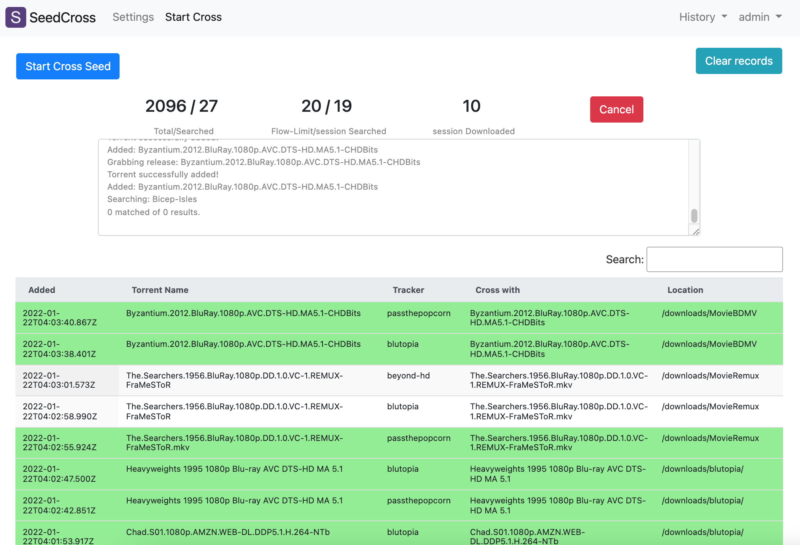

# 外站辅种软件 SeedCross

* 对下载器(Deluge/qBittorrent/Transmission)中的种子，通过Jackett/Prowlarr在各外站上寻找匹配的种子，以暂停状态加入到下载器，供进一步检查完成辅种
* 参考 [CrossSeedAutoDL](https://github.com/BC44/Cross-Seed-AutoDL)


## Last update
* 2022.5.5:  `Fix` 功能，可在界面上操作对目录不匹配的种子通过软链(ln -s)作修复，需要下载器和seedcross运行在同一台机器，（或者把目录mount过来）. 对于下载器在docker中的 或 seedcross运行在docker中的，可以设置目录的map.
* 2022.4.29: dev merge to main
* 2022.3.29: deluge client, download_location => save_path
* 2022.3.6: mount db dir (/code/seedcross/db) externally




## 前置条件
* [Jackett](https://github.com/Jackett/Jackett) / [Prowlarr](https://github.com/Prowlarr/Prowlarr): 外站众多，形态各异，Jackett/Prowlarr 作了相对统一的适配，因此，这里通过 Jackett/Prowlarr 进行种子搜索。如果你还没有安装，可参考：[这里](https://github.com/ccf-2012/ptnote/blob/main/CrossSeed.md#jackett-%E5%AE%89%E8%A3%85)
* Deluge/qBittorrent/Transmission：略
* Docker：可以是任何支持Docker的环境，比如 nas，seedbox, 你的笔记本也行，它运行起来没什么负担

## 安装
* 所需要的就是映射 `8019` 端口出来，以便浏览器访问。


* 在装有Docker的环境中，运行以下命令, 替换 `/somedir/in/host` :
```sh
docker run -d --name seedcross -v /somedir/in/host:/code/seedcross/db -p 8019:8019 ccf2012/seedcross:latest
```


或者使用 docker-compose.yml, 同样替换 `/somedir/in/host` 
```yml
version: "3"
services:
  seedcross:
    container_name: seedcross
    image: ccf2012/seedcross
    volumes:
      - /somedir/in/host:/code/seedcross/db
    ports:
      - 8019:8019
    restart: unless-stopped
```

## 以源码安装和启动
* create a virtualenv
```sh
# install virtualenv with root
sudo pip install virtualenv

# create a virutalenv
virtualenv  seed
source seed/bin/activate
```

* clone the source
```sh
git clone https://github.com/ccf-2012/seedcross.git
```

* build the db
```sh
cd seedcross
mkdir db
python manage.py migrate

# create a admin user
python manage.py createsuperuser
```

* (optional) set db to wal mode, to reduce sqlite3's 'table is locked'.
```sh
cd db
sqlite3 db.sqlite3 'PRAGMA journal_mode=wal;'
cd ..
```

* run the server
```sh
# better with a screen or tmux
screen 
# under seedcross folder 
chmod +x start.sh
./start.sh
```


## 开始使用
1. 浏览器中打开 `http://<your-ip>:8019` 
2. 用户名:密码  `admin`:`admin`

## 设置参数
* 首先进`Settings`页面，这里的每个参数都要小心填写：
1. Download Client Setting: 
  * 下载器的 `Type`, `Host`, `Port`, `Username`, `Password` , 注意 `Host` 都是IP地址，而不是带 `http://` 和端口的 url。
2. Jackett/Prowlarr Setting: 
  * `Jackett/Prowlarr Url` 填写 `http://<server ip>:<port>/`, 即前面有`http://` 后面到 端口号 为止, 打开你已经配置好的 Jackett 网页，拷贝右上角的key拷到 `Jackett/Prowlarr Api key`
  * Trackers / Indexers in Jackett: 留空就会搜索全部配置的tracker。如果你想只搜某几个tracker, 这里要填的就是在Jackett中 `torznab feed URL` 里面 `indexers/` 和 `/results` 中间那个单词，用,分隔。对于Prowlarr，这里要填的是数字，在Indexer info里可以找到。
3. Flow Control Setting: 
  * Flow control: Count limit: 如果你下载器中有几千种子，持续搜索将会对tracker服务器带来负担，所以把这个值设置为一个你觉得安全的上限。SeedCross会管理搜索的历史，下次搜索时会跳过那些已经搜过的种子。
  * Flow control: Interval: 查询间隔，每次查询之后暂停几秒。
4. 填完上述信息后，点击 `Save Settings`, 明显的错误如url/ip格式不符，界面会停在设置页面，并有错误信息提示，否则就会转到 `Start Cross` 页面。

## Start Crossing
1. 点击 `Start Cross` 按钮, SeedCross就会开始:
    1. 从下载器中读入种子
    2. 解析种子名字以获得 title,year,episode 等， 以这些信息通过Jackett去到各站进行搜索
    3. 对搜索结果进行筛选
    4. 将筛选出的种子，其下载链接加入到下载器，并确保是暂停状态，不论下载器设置中全局设置是否暂停，注意如果相同的种子已经在下载器中，就会忽略
* 已经查过的种子将不会提交搜索
* 含有 CJK 字符和种子将不会提交搜索
* 如果点击 `Start Cross` 按钮时，还没有设置好必要信息，就会转到 `Settings` 页. 

2.  在处理过程中，会显示一个进度面板，其中包括:
  * Total/Searched: 在下载器中的种子总数 / 到现在已经处理的种子数，包括跳过的
  * Flow-Limit/Searched of this session: 你所设置的流控数量 / 本次搜索已经发起的查询次数
  * Downloaded torrent in this session：本次搜索中，找到的匹配。需要说明的是，如果你已经对这批种子作过多次辅种，有可能找到的匹配是已经在下载器中了，所以这里的列表和下载器中不一定会一一对应
  * 有一个滚动的 text box 显示 info/error 消息。这消息就用来看看的，出现错误时可以试着猜猜发生了什么，如果刷新页面，前面的消息是会消失的

3. 一次辅种处理过程将会在下列情况停止:
  * 配置错误：下载器连不上，下载器登陆密码错，Jackett地址错或Api key填错
  * 查询次数达到 Flow limit count
  * 下载器中的种子已经全部遍历
  * 用户点击了 Cancel 按钮
* 如果没有活动的cross任务，进度面板在页面刷新时会消失

## Search History
* 查过的种子会被存在一个History表中，这些种子在下次查询时将会跳过，即使你已经开始在另一个下载器进行辅种查询.
* 如果你又收了个新站，你可能会想重新进行搜索，点击菜单中的 `Clear Search History` 就会删除所有记录.


## 数据库备份与恢复
* docker方式安装时，前述安装时 `/somedir/in/host` 所指向的地方是保存数据库的，备份此目录即可
* 源码安装的话，数据库位置在 `seedcross/db` 目录


## 关于匹配的说明

本辅种方案的流程是这样：
1. 从下载器中取得种子列表，从种子标题中提取影片名称，使用Jackett/Prowlarr到各站搜索相同影片名字的种子，（直接使用文件名是无法搜到的，需剥离其它额外字串，仅搜影片名字)，在Jackett/Prowlarr返回的信息中通过比对大小进行匹配。
2. 在返回的信息中，寻找**大小匹配**的种子链接，发给下载器，由下载器通过Jackett/Prowlarr下载
3. 种子真正的标题及文件名，要在种子下载下来后才能得知，因而若要比较种子文件是否匹配时，种子已经在下载器上了，当前处理流程是保留这些种子，只在界面上标注是否匹配，由用户查看是否还有救。
4. 未来可能可以作的改善可以是 (not scheduled)：
   1. 仍然保持下载器下载的方案，在下载完后将不匹配的种子删除
   2. 先由seedcross下载种子文件，处理判断后将种子文件提交下载器


## 关于Fix的说明
### Fix的功能
* 辅种时会碰到以下情形：
1. 同样是文件或目录，但名字稍有不同的，如：
```
Olympus.S01.1080p.GBR.Blu-ray.AVC.DTS-HD.MA.5.1-PzD
Olympus S01 1080p GBR Blu-ray AVC DTS-HD MA 5.1-PzD

Prometheus.2012.COMPLETE.UHD.BLURAY-TERMiNAL
Prometheus.2012.2160p.BluRay.HEVC.DTS-HD.MA.7.1-TERMiNAL

JET PILOT
Jet Pilot 1957 2in1 1080p Blu-ray AVC DTS-HD MA 2.0-MM
```

2. 一个是文件，另一个是目录，而目录内文件是相同的，如：
```
Lost.Highway.1997.1080p.BluRay.DD+5.1.x264-LoRD/
Lost.Highway.1997.1080p.BluRay.DD+5.1.x264-LoRD.mkv
```
* 对于这样的种子，在界面上点击 `Fix` 会尝试制作目录/软链使之匹配。软链建成功了，表格条目将标浅蓝
* 对于多个相同的条目，只有点击的那个会标蓝，因为已经建了软链，对其它相同条目点Fix将无法成功，所以不会标蓝。
* 对于已经是标蓝的条目，再次点击 `Fix` 将清掉标蓝（软链不会变化），然后再次点击将再次执行
* 被Fixed的种子，可在下载器中对它们作强制校验，尝试辅种

### 目录映射
* 如果下载器是以docker安装，或者seedcross是以dockeer安装，则进行这样的软链Fix操作，需要对操作目录作映射
* 作软链操作的是seedcross，所以最终映射应以seedcross所理解的目录为目标
1. 若seedcross和下载器都没有在docker中，则不应用映射，`Map From:` 为空则不作映射
2. 若seedcross源码安装，而下载器在docker中，其下载目录比如在 `/downloads`，对应host的 `/volume1/downloads`，则应在seedcross中设置`Map from:` 为 `/downloads` 而`Map to`设为 `/volume1/downloads`
3. 若seedcross在docker中，则应映射一个位置给此docker用于操作，比如 `/torrents` 指向下载器的下载路径，若下载器也在docker，配置同2，则应在seedcross中设置`Map from:` 为 `/downloads` 而`Map to`设为 `/torrents`


## Acknowledgement
1. Aruba@hutongyouwu 
2. [CrossSeedAutoDL](https://github.com/BC44/Cross-Seed-AutoDL)

